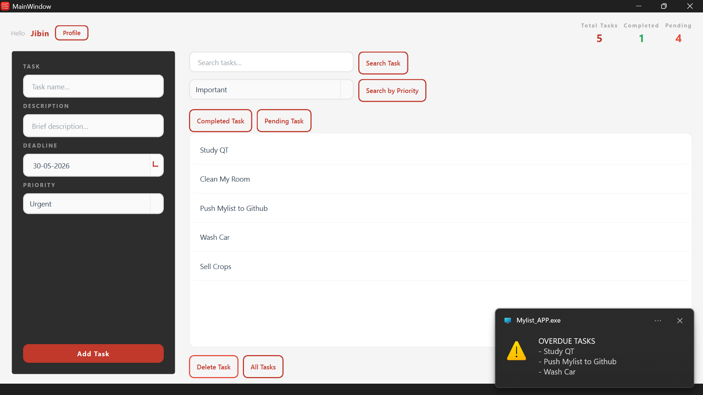
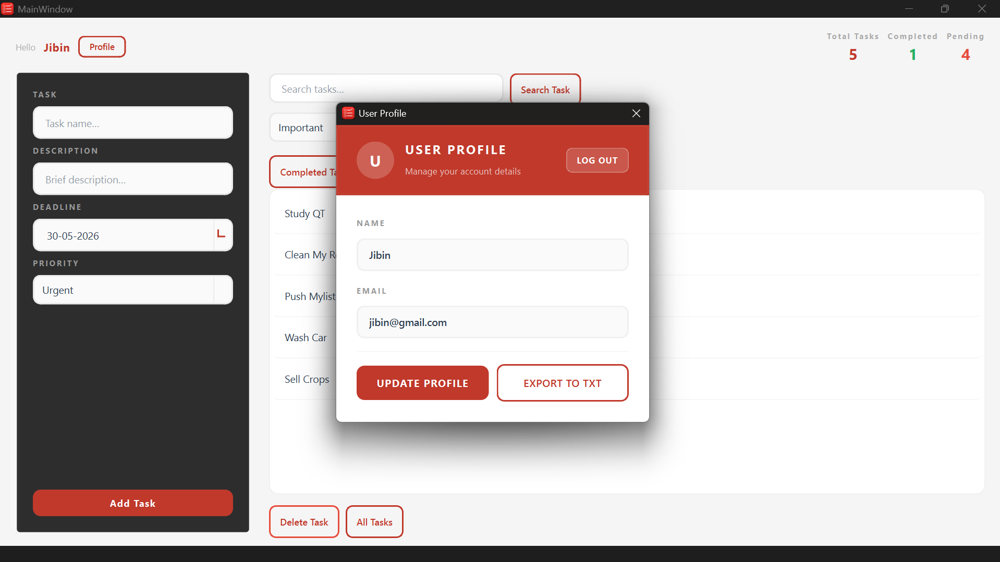
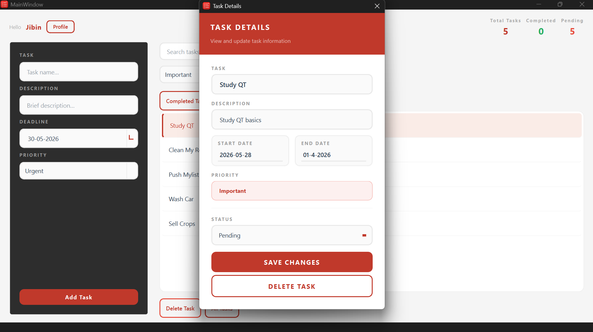

# Mylist

Mylist is a modern desktop To-Do List application built using **C++** and the **Qt Framework**.
The application helps users manage tasks efficiently with reminders, notifications, task exporting, and a clean QSS-styled user interface.

---

# Features

* User Authentication System
* Task Management (Create, Delete, Search)
* Task Details Dialog
* Reminder System
* Overdue Desktop Notifications
* Task Export to TXT File
* QSS Styled Modern UI
* Portable Desktop Deployment Support

---

# Technologies Used

* C++
* Qt
* SQLite
* QSS (Qt Style Sheets)
* CMake

---

# Screenshots

## Login Page


---

## Dashboard



---

## User Profile



---

## Task Details



---

# Project Structure

```text
MYLIST_APP/
│
├── Forms/
├── Headers/
├── Sources/
├── Styles/
├── icons/
│
├── resources.qrc
├── CMakeLists.txt
├── README.md
├── .gitignore
```


# Future Improvements

## Planned AI Integration

Future versions of Mylist aim to integrate AI-powered productivity features such as:

* Smart Task Prioritization
* AI Task Suggestions
* Deadline Prediction
* Productivity Analytics
* Natural Language Task Input
* AI Reminder Recommendations

---

# Author

Developed by Jibin George
